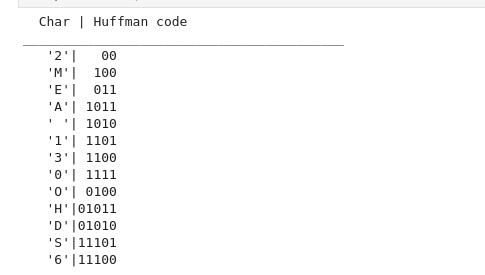

# Huffman-Coding
## Aim
To implement Huffman coding to compress the data using Python.

## Software Required
1. Anaconda - Python 3.7

## Algorithm:
### Step1:
<br>
GET INPUT STRING


### Step2:
<br>
CREATE TREE NODES

### Step3:
<br>
MAIN FUNCTION IMPLEMENT HUFFMAN CODING

### Step4:
<br>
CALCULATION FREQUENCY OF OCCURENCE

### Step5:
<br>
PRINT THE CHARACTER AND ITS HUFFMANSCODE

 
## Program:

``` Python
# Get the input String

string = 'MOHAMED ASEEM 212221230063'
class NodeTree(object):
    def __init__(self, left=None, right=None): 
        self.left = left
        self.right=right
    def children(self):
        return (self.left,self.right)
    


# Create tree nodes

def huffman_code_tree (node, left=True, binString=''):
    if type(node) is str:
        return {node: binString}
    (l, r) = node.children()
    d = dict()
    d.update(huffman_code_tree (l, True, binString + '0'))
    d.update(huffman_code_tree (r, False, binString + '1'))
    return d


# Main function to implement huffman coding

freq = {}
for c in string:
    if c in freq:
        freq[c] += 1
    else:
        freq[c] = 1
freq = sorted(freq.items(), key=lambda x: x[1], reverse=True)
nodes=freq


# Calculate frequency of occurrence

while len(nodes)>1:
    (key1,c1)=nodes[-1]
    (key2,c2)=nodes[-2]
    nodes = nodes[:-2]
    node = NodeTree (key1, key2)
    nodes.append((node,c1 + c2))
    nodes = sorted (nodes, key=lambda x: x[1], reverse=True)


# Print the characters and its huffma![Screenshot from 2023-05-31 14-43-48]

huffmanCode=huffman_code_tree(nodes[0][0])
print('  Char | Huffman code ') 
print('_________________________________________')
for (char, frequency) in freq:
    print('%6r|%5s'%(char,huffmanCode[char]))


```
## Output:

### Print the characters and its huffmancode
<br>

<br>
<br>
<br>
<br>
<br>


## Result
Thus the huffman coding was implemented to compress the data using python programming.
